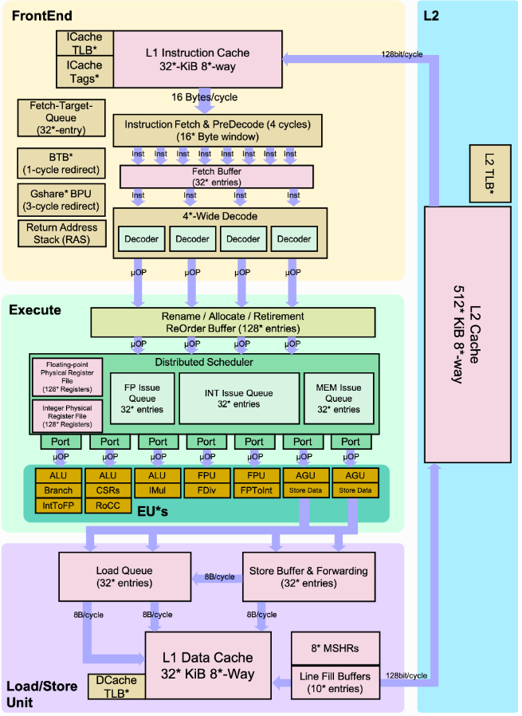

# BOOM core

According to Chipyard's documentation:
The Berkeley Out-of-Order Machine ([BOOM](https://chipyard.readthedocs.io/en/stable/Generators/BOOM.html)) is a synthesizable and parameterizable open source RV64GC RISC-V core written in the Chisel hardware construction language. It serves as a drop-in replacement to the Rocket core given by Rocket Chip (replaces the RocketTile with a BoomTile). BOOM is heavily inspired by the MIPS R10k and the Alpha 21264 out-of-order processors. Like the R10k and the 21264, BOOM is a unified physical register file design (also known as “explicit register renaming”). Conceptually, BOOM is broken up into 10 stages: Fetch, Decode, Register Rename, Dispatch, Issue, Register Read, Execute, Memory, Writeback and Commit. However, many of those stages are combined in the current implementation, yielding seven stages: Fetch, Decode/Rename, Rename/Dispatch, Issue/RegisterRead, Execute, Memory and Writeback (Commit occurs asynchronously, so it is not counted as part of the “pipeline”).

<p align='center'>

</p>

## Table of Contents

- [Build your first boom core](#build-your-first-boom-core) explains how to generate RTL files for your first boom core.
    * [Setting up TutorialConfig](#setting-up-tutorialconfig-boom)
    * [Run a binary test](#run-a-binary-test-boom)
- [Custom your BOOM core](#custom-your-boom-core) explains how to custom your boom core.

## Build your first boom core

You can choose which BOOM core you want. There are four configuration: [SmallBOOM](./ConfigFiles/SmallBOOM.log), [MediumBOOM](./ConfigFiles/MediumBOOM.log), [LargeBOOM](./ConfigFiles/LargeBOOM.log) and [MegaBOOM](./ConfigFiles/MegaBOOM.log). The GigaBOOM option is present but cannot be generated at the moment.

### Setting up TutorialConfig Boom

Before compiling a custom configuration, it is strongly recommended that you understand how ``TutorialConfigs`` works.

1. Have a look at the file

```shell
cd chipyard/generators/chipyard/src/main/scala/config
```


The default architecture can be customised. Uncomment the line to activate the desired feature.

:warning: ``WithInclusiveCache(nBanks=1, nWays=4, capacityKB=128)`` **seems to produce an error since** ``nBanks`` **is not recognised as a known parameter.**


2. Start the Verilator RTL build 
```shell
cd chipyard/sims/verilator
make CONFIG=TutorialStarterConfig
```

This builds the RTL files associated with your ``TutorialStarterConfig``.

### Run a binary test

Once the RTL files for rocket's default core have been generated, it's time to check whether or not your architecture works, and to evaluate the corresponding performance.

1. Navigate to the Verilator directory

```shell
cd chipyard/sims/verilator
```

2. Run a basic RISC-V binary test

```shell
export BINARY=$RISCV/riscv64-unknown-elf/share/riscv-tests/isa/rv64ui-p-simple
make CONFIG=TutorialStarterConfig run-binary
```

## Custom your BOOM core

To custom your BOOM core, there are some files containing the parameters of the core. They are locates at this location:

```shell
chipyard/generators/boom/src/main/scala/v3/common/config-mixins.scala
```