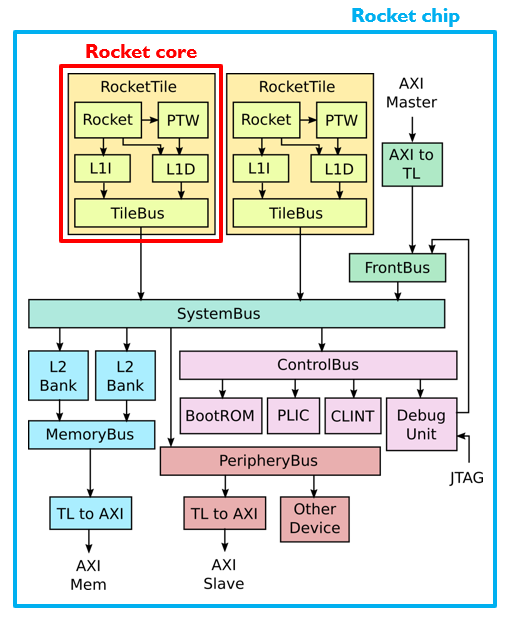

# Rocket core

According to Chipyard's documentation:
*[Rocket](https://chipyard.readthedocs.io/en/stable/Generators/Rocket.html) is a 5-stage in-order scalar processor core generator, originally developed at UC Berkeley and SiFive, and now maintained by Chips Alliance. The Rocket core is used as a component within the Rocket Chip SoC generator. A Rocket core combined with L1 caches (data and instruction caches) form a Rocket tile. The Rocket tile is the replicable component of the Rocket Chip SoC generator*.

## Table of Contents

- [Build your first rocket core](#build-your-first-rocket-core) explains how to generate RTL files for your first rocket core.
    * [Setting up TutorialConfig](#setting-up-tutorialconfig)
    * [Run a binary test](#run-a-binary-test)

## Build your first rocket core

### Setting up TutorialConfig

### Run a binary test